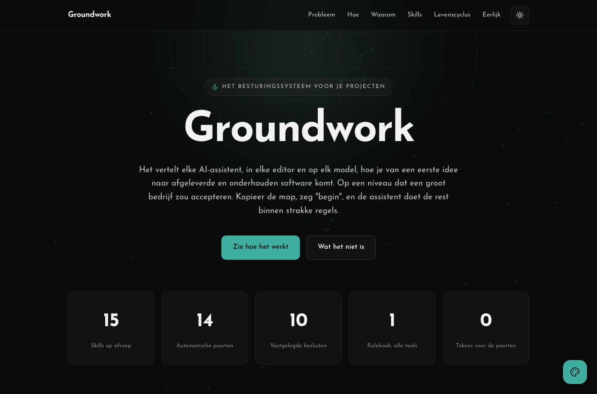

# Groundwork

A copy-before-you-start engineering system. Duplicate this folder, open it with any capable AI
coding agent (Claude Code, Cursor, Copilot, Codex, Gemini CLI, Windsurf, JetBrains, any), and
build enterprise-grade software from first idea to delivery and maintenance. The system carries
everything a project needs to begin correctly, before the first line of product code exists.

## See what it can be

An interactive explainer ships with the repo. Open
[groundwork-explained.html](groundwork-explained.html) in any browser for the full thing: light
and dark themes, six color palettes, six fonts, and smooth scroll motion. The preview below
follows your GitHub theme.

<picture>
  <source media="(prefers-color-scheme: dark)" srcset="docs/design/reference/explainer-dark.png">
  <source media="(prefers-color-scheme: light)" srcset="docs/design/reference/explainer-light.png">
  
</picture>

## Start a project

1. **Copy** this folder to a new location and rename it after your project.
2. **Open it** in your IDE / agent of choice.
3. **Say `begin`** (or tell the agent to load the `begin` skill). It will interview you about
   scope and goals, set up git, fill in the templates, and propose the first real step.
   (Design taste comes later, when the `design` skill needs it.)

That's it. The agent takes it from there. The rules in [AGENTS.md](AGENTS.md) tell it how.

## How it works

- **[AGENTS.md](AGENTS.md)** is the single always-loaded rulebook, written to the open
  [agents.md](https://agents.md) standard that all major agent tools read. `CLAUDE.md` (Claude
  Code) and `.gemini/settings.json` (Gemini CLI) are one-line bridges to it. Never edit those.
- **[.agents/skills/](.agents/skills/)** holds the expert methods (scoping, spec, stack choice,
  design, verification, delivery, maintenance, compliance ...) in the open
  [Agent Skills](https://agentskills.io) format. They load on demand, so they cost no context
  until needed. `.claude/skills` is a symlink to this directory.
- **[docs/](docs/)** is the project's externalized memory: live state and session handoff,
  scope, specs, decisions, standards, design system, compliance register. Agents read state from
  disk instead of re-deriving it every session. [docs/README.md](docs/README.md) is the manifest.
- **[checks/](checks/)** enforces hygiene mechanically: `node checks/check.mjs` validates the
  docs manifest, link integrity, retired-fact denylist, file budgets, skill format, secrets, and
  more: zero model tokens spent. CI runs it on every push. The checks test themselves
  (`node checks/check.test.mjs`): a gate that isn't tested is false confidence.

## Requirements

- Any AI coding agent. No vendor lock-in: one rulebook, open standards, plain Markdown.
- Node.js ≥ 20 for `checks/` (the only tooling dependency until you choose a stack).
- On Windows: enable Developer Mode so the `.claude/skills` symlink works after
  `git clone -c core.symlinks=true`. No symlink support? Set `"skipSymlinkCheck": true` in
  `checks/config.json` and point your tool at `.agents/skills/` directly.
- After every fresh clone: `node checks/check.mjs --install-hooks` (wires the versioned
  pre-commit gate).

## What lives where

| Path | What it is |
|---|---|
| `AGENTS.md` | Always-on rules + routing table (the front door for agents) |
| `README.md` | This file (the front door for humans) |
| `.agents/skills/` | Skill library: expert methods, loaded on demand |
| `docs/` | Project memory: state, scope, specs, decisions, standards, design, compliance |
| `checks/` | Zero-token enforcement: hygiene checks + their self-tests |
| `.github/workflows/ci.yml` | CI quality gate (extended per stack by the `stack` skill) |

Templates you fill per project are marked `TEMPLATE` at the top; the `begin` and follow-up
skills fill them in the right order. Files without that marker are the system itself.

## License

MIT: see [LICENSE](LICENSE). Use it, copy it, adapt it, ship with it, for anything. No
attribution required (though it's appreciated). Each project you build on Groundwork sets its
own license via the `comply` skill.

## Handing over

Everything an agent or human needs is in the repo: state in `docs/state/STATE.md`, decisions in
`docs/decisions/`, the rest via the routing table in `AGENTS.md`. To hand the project to someone
else (different IDE, different model), give them the repo. Nothing lives outside it.
